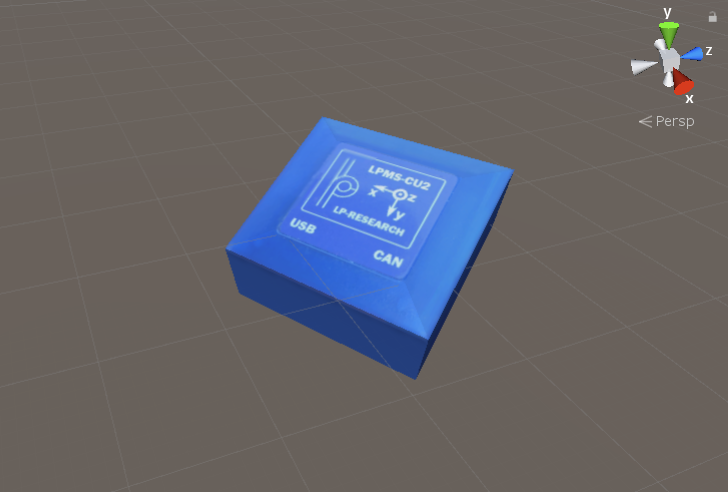

# OpenZenUnity

Unity Demo for OpenZen usage.

## Usage

Connect a LP-Research IMU via USB or Bluetooth and open the Unity project. Once
you loaded the project, click on Assets -> Scenes in the Project explorer and double-click
the DiscoverSensorsScene item. You can start the project, this may take a couple of seconds because
OpenZen searches for all connected sensors. After this, you can select one sensor and should see the virtual
sensor rotate, if you rotate the real-world sensor. You may need to move the Unity
camera to align the rotation directions between the virtual and real-world sensor.

The scene ConnectByNameScene demonstrates how you can connect to a sensor directly without
running the sensor discovery first.

## OpenZen Library

This demo compiles a pre-compiled OpenZen DLL for Windows 64-bit. You can find the
source of OpenZen [here](https://bitbucket.org/lpresearch/openzen/).

## External Licences

This repository contains the SiLabs DLL USB Xpress driver. Please see
Silabs_Licence_Agreement.txt for licence details.
